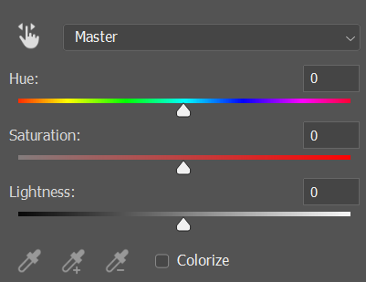

# Web Accessibility for Marketers

## Overview
Hi! Welcome to Karen's guide to web accessibility for marketers.

I adapted this guide from the one I wrote on [accessibility for web developers](https://github.com/electricdinosaurs/accessibility-demo) to be more relevant to people without a coding background. Knowledge of web accessibility is still important for any organization to produce quality content. So this document is a summary of the other one, with 90% less code and 100% of the content.

After this workshop, you should have a basic understanding of what kinds of needs we should be meeting as marketers on the web. You should be able to evaluate all sorts of digital materials using your familiarity with accessibility guidelines, with the help of convenient tools.

This workshop assumes little to no knowledge of coding, but a basic familiarity with content management systems like Weebly or Wordpress.

## Table of Contents

* [What Does Accessibility Involve?](#what-does-accessibility-involve)
* [Appearance](#appearance)
  * [Fonts and Font Sizes](#fonts-and-font-sizes)
  * [Line Height](#line-height)
  * [Zoom Levels](#zoom-levels)
  * [Color Contrast](#color-contrast)
* [Images and Videos](#images-and-videos)
  * [Alt text](#alt-text)
  * [Transcripts](#transcripts)
  * [Autoplay](#autoplay)
  * [Animations](#animations)
* [Content Reading Level](#content-reading-level)
* [Conclusion](#conclusion)
* [Accessibility Checkers](#accessibility-checkers)
* [Further Reading](#further-reading)
* [Reference Links](#reference-links)

## What Does Accessibility Involve?

What comes to mind when you think of the word "disabled" or the word "accessible"? Our assumptions about these words don't always tell the whole story. 

To create the best user experience, we should be comfortable with constantly adapting to the most recent accessibility standards.

For many, poor accessibility features are an inconvenience at worst or even unnoticeable at best. But for an equally important population, these features can make or break their experience with your website. 

These users experience a range of needs, including colorblindness, use of a screenreader (for people with visual impairments, people with learning disabilities, etc.), poor vision (for the elderly, people with visual impairments, etc.), susceptibility to seizures, and more. 

Why is this so important, you ask?

1. Make websites functional and enjoyable for users with different needs
1. Everyone benefits from accessible websites
1. Increase traffic and user satisfaction (you could say this is the ultimate goal for a marketer...)

Each part of your website that you design will be used by all kinds of different people. So, we need to think about how these parts can meet the needs of our users. Many web designers (like me) can get too caught up in what looks "cool" and not what is actually legible or usable. 

Good web design, like any kind of design, is a balance of both *aesthetic* and *function*.

## Appearance
We'll start with the visual appearance of websites, since most of us will already be familiar with the qualities that make a website visually accessible or inaccessible. 

### Fonts and Font Sizes

Have you ever visited a website with an uncomfortably large font? What about an Instagram post with text so small you have to squint to read it? Fortunately, someone was smart enough to come up with standard font sizes for mobile and desktop (16px and 18px, respectively).

If you have trouble fitting your content onto one image or page at these sizes, it's time to either reduce your word count or increase the number of pages. Less is more, friends. Readable content is always better than lots of content that no one reads.

Fonts can still look too small or too large at these sizes, so adjust as needed. Actually, two fonts at the exact same size can look pretty different. For example, check out the following images of Calibri and Lucida Bright, both at 16px...

Mini typography lesson: serif fonts like Times New Roman are often used in body text, because serifs aid the eye in reading text. (Serifs are the little hooks on the ends of letters, like on the ends of the Ts in the Lucida example above.) Sans serif fonts like Arial are also popular because they look sleek and modern. 

We stick to basic serif and sans serif fonts because using display (aka fancy) fonts in body text slows down the brain's processing of text.  

A good rule of thumb is to copy a paragraph of a random article into your chosen font, and see if you can easily scan the paragraph. If not, it's probably not a good choice for your website.

### Line Height

A short note on line height: closely packed paragraphs of text can be really awful to read! The standard for paragraph text (as opposed to headings and other text) says that we should have a line height at least 1.5x as large as our font size.

### Zoom Levels

Users with visual impairments, such as the elderly, often need to zoom in on 16px or 18px text in order to be able to read clearly. As you're designing your website, try zooming in up to 200% and see if the website is still usable. If elements are jumping around or hiding text at this zoom level, that's bad news.

### Color Contrast 

Color blindness affects 1 in 12 men and 1 in 200 women worldwide. For these people, as well as people with low vision, it can be hard to read text against a noncontrasting background. 

What does color contrast mean, exactly?

Technically, there are three types of contrast: hue, luminance, and saturation. The difference between the three can be found in any Adobe Photoshop properties panel:

What we're mainly addressing here is luminance contrast, since high hue contrast doesn't help if luminance contrast is still low. To illustrate, take the following example of green text on a red background. Even though red and green have very different hues, you can see that the end result is pretty unpleasant. 

What's up with the second image? That's what would happen if you sucked all the color out of the red and the green. This desaturated example shows why the first image was so ugly: it's because the two colors are too similar in luminance! That's what makes noncontrasting colors hard to read.

**Important: these examples are for illustrative purposes and are an oversimplification of color blindness.** Check out our resources for a tool you can use to [simulate color blindness](#accessibility-checkers) on images.

In the real world, bad color contrast can be hard to spot. Thankfully, you don't have to calculate any ratios yourself. Color-contrast checkers help us make sure that our text and visual elements pass standards. 

Sometimes we'll be tempted to place text over images. It's very difficult to make sure that each of the different color combinations in these instances pass standards! So it's best to avoid background images when the overlaying text is essential to using the site.

Large text literally has larger shapes, which makes it slightly easier to see/read. In the color contrast checker image, you can see that large text has slightly more lax standards. If you must place text over images, larger text is a better way to go.

## Supporting Screenreaders

This is probably the most important topic that we'll cover today&mdash;the following are often invisible to the average user, but can make or break the site experience for someone using a screen reader.

What is a screen reader, anyway? It's a piece of software that reads out the screen contents for people with visual impairments and others. These kinds of software can't read text on images, so it's generally better to write out text instead of uploading an image with the text. 

The exception is logos. If you can't avoid using a non-logo image with text in it, try providing a summary in the [alt text](#alt-text).

(Optional: download and [try out a screenreader](https://www.nvaccess.org/download/) for yourself.)

### Tabindex

Tabindex refers to tabbing through the buttons or links (or "focusable" elements) on a page using the Tab key on the keyboard. This feature can be used by people navigating by keyboard, as well as people using screen readers. 

Try it yourself: stop here and press "Tab" until you have navigated all the "tabbable" elements on the page. Imagine that you are using a screenreader, so you can't see the context around each link as you're doing this. If you read just the highlighted text as you tab around the page, can you still tell where each link leads?

"Click here" and other phrases without context can be confusing to people who are navigating a site by the links only. Even worse, imagine a screen reader reading a raw link like https://github.com/username/project/master/README.md. That would be awful! 

Instead, we should label links and buttons in an informative way. For the above example, a better link would be "[visit my project](https://github.com/electricdinosaurs/accessibility-demo/master/README.md)". Descriptive labels allow the user to know what to expect when they visit a link.

Keeping tabindex in mind, we should organize links and buttons in a meaningful order. This is relatively context-dependent, but as an example, "Create Account" and "Log In" are usually adjacent to each other. It wouldn't make sense to have these links separated by several other links on the page, just like it wouldn't make sense to have "Epilogue" next to "Introduction" in a book.

## Images and Videos

Embedded media can be difficult to consume for many populations and for many reasons. Any visual element usually requires a text alternative.

### Alt text

You've seen alt text before, which is displayed when an image file fails to load. It's also read by [screenreaders](#supporting-screenreaders). 

Always provide alt text for images that have meaning. For example: a decorative background image of a stripe pattern probably does not need alt text, but an illustrative image of the company's logo probably does. 

A good rule of thumb is if the image adds context to the page that isn't already present in surrounding text, then alt text is needed. If nothing new is added, then `alt=""` is okay. 

On Weebly and other content management systems, alt text is usually built-in to image elements.

Writing good alt text takes a little thought. Think of it as similar to a caption, only as brief as possible. For example, do not write "Image of..." or "Graphic of..." since it's usually obvious what the element is. However, "Painting of..." may be used since the user would not know this if the image had failed to load. 

Be accurate when describing image content&mdash;we shouldn't provide information that is not present in the media. 

Alt text for icons follows the same conventions as for images, since some icons (such as file-type icons) add context.

The only situation where alt text can be redundant with surrounding text is when an image functions as a link. In that case, alt text must be present to act as a link, so `alt=""` is not allowed. Again, "Link to..." is not necessary as it is clear that the image is a link.

We should only use decorative background images, because if there is something vital to the page on a background image, we always run the risk of something accidentally covering it. 

In summary, when writing alt text, we should ask ourselves:

1. Does this image/icon add context (or does it function as a link)?
1. Is my alt text as brief as possible?
1. Does my alt text accurately and fully describe the image? 

### Transcripts 

English language learners and people with hearing impairments can have difficulty following audio or video elements. Transcripts and subtitles are also useful in noisy environments or when skipping through media to find specific information. 

WebVTT files are the standard for closed captions. YouTube provides auto-produced transcripts that are easy to download and modify. (This is always a good idea, since the algorithms butcher names and topic-specific words or phrases, such as "Weebly" or "x axis".)

If you can't obtain a WebVTT file, try providing at least a written summary or list of objectives for the video so that the user doesn't miss out on the content.

Keep transcript files as attachments or links positioned near the video if you don't know how to attach them to the video itself. (If you're interested in some light coding, check out this [guide to providing video transcripts]().)

### Autoplay

Autoplay can be disorienting for users, as well as annoying (have you ever tried to find that one tab that randomly starts playing music? Yeah).

Disabling autoplay for videos shouldn't be a problem, since most videos are displayed. Controls should be visible so that the user can explore the video at their own pace.

Similarly, allow users to pause and navigate slideshows&mdash;it can be distracting to see a constantly sliding slideshow when you're trying to focus on a different part of the page. Plus, many slideshows move too fast for some users to read each slide. 

Since slideshows are usually made using JavaScript, we won't cover how to do it here.

### Animations

Many people are prone to seizures and can be harmed by websites with too much animation. This means limiting the number of GIFs, and avoiding flashing elements at all costs (the w3 standard is three flashes or less per second).

## Content Reading Level 

Although web developers often aren't responsible for writing site content, 1) they can be and 2) they are often asked for feedback on content.

Unclear or complicated language affect English language learners, people with reading disabilities, and others. For general-audience websites, the standard is to use language at an 8th-grade reading level.  

You'll also find that many words or phrases can be replaced with simpler ones. (Who wants to read 1000 words when you can get the same thing across in 500?) Towards this end, avoid the passive voice and avoid convoluted sentence structures.

Finally, correct spelling and grammar aren't just for nitpickers: they allow for more efficient communication as well as greater professionalism.

## Conclusion

It might seem that there are suddenly a million things to worry about that you didn't think about before. Don't sweat it if you can't remember everything. What's important is to start looking at websites you use and the websites you create with a critical eye, asking: "How does this meet accessibility guidelines?", "How might this website be hard for some people to use?", and "What can I do to make my website functional and enjoyable for everyone?" Once you've identified a problem, you can always Google the solution to jog your memory.

As a review, here are the topics we've covered:
* Fonts and font sizes
* Accommodating different zoom levels
* Color contrast
* Alt text
* Video autoplay
* Limiting animation and flashing effects
* Tabindex and labeling links
* Content reading level

A final note: accessibility shouldn't be an afterthought. You'll make it easier for yourself and your users if you think about it early on: when you're picking your fonts and color palette, when you're creating elements in HTML, and when you're structuring the flow of your website. 

Want to put your new knowledge into practice? Start out by turning a critical eye on your [portfolio task](https://github.com/uclaacm/learning-lab-crash-course-su20/blob/master/task-1-portfolio/README.md) from earlier in this course, as well as any other websites you may have made. Use the tools below to help you make your website beautiful *and* accessible for all users! 

Or, check out the [anti-accessibility example website](https://electricdinosaurs.github.io/accessibility-demo/) attached to this repository that breaks all of the rules we mentioned. Try forking the project or playing around in the browser inspector mode to see how you can make it less awful. 

## Accessibility Checkers

Never rely on a machine to "check off" accessibility requirements. (Here is a blog post that shows [how machines can make mistakes sometimes](https://www.matuzo.at/blog/building-the-most-inaccessible-site-possible-with-a-perfect-lighthouse-score/).) Still, I highly recommend saving these resources for later&mdash;I use them all the time and they are great aids for checking how your website measures up. 

* [WAVE browser extension](https://chrome.google.com/webstore/detail/wave-evaluation-tool/jbbplnpkjmmeebjpijfedlgcdilocofh)
* [w3 evaluation tools](https://www.w3.org/WAI/ER/tools/)
* [Color blindness checker](http://color-blindness.com/coblis-color-blindness-simulator/)
* [Color contrast checker ](http://webaim.org/resources/contrastchecker/)
* [Accessibility checker](http://wave.webaim.org)
* [Hemingway reading level checker](http://www.hemingwayapp.com/)

## Further Reading

Want to learn about AA versus AAA standards, input errors, and more? Check out these comprehensive accessibility guides from top-tier institutions.

* [Elsevier guidelines](https://www.elsevier.com/about/policies/accessibility)
* [Yale guidelines](https://usability.yale.edu/web-accessibility/articles)

## Reference Links

These articles will save you some googling on the topics we've covered today.

Appearance
* [Font size guidelines (Learn UI)](https://learnui.design/blog/mobile-desktop-website-font-size-guidelines.html)
* [Basic color theory](http://www.colorsontheweb.com/Color-Theory/Color-Contrast)
* [Forms (w3)](https://www.w3.org/WAI/tutorials/forms/instructions/)

Supporting Screenreaders
* [Tabindex (MDN)](https://developer.mozilla.org/en-US/docs/Web/HTML/Global_attributes/tabindex)
* [Hyperlink accessibility (Yale)](https://usability.yale.edu/web-accessibility/articles/links)
* [Alt text (WebAIM)](https://webaim.org/techniques/alttext/)

Images and Videos
* [WebVTT files (MDN)](https://developer.mozilla.org/en-US/docs/Web/API/WebVTT_API)
